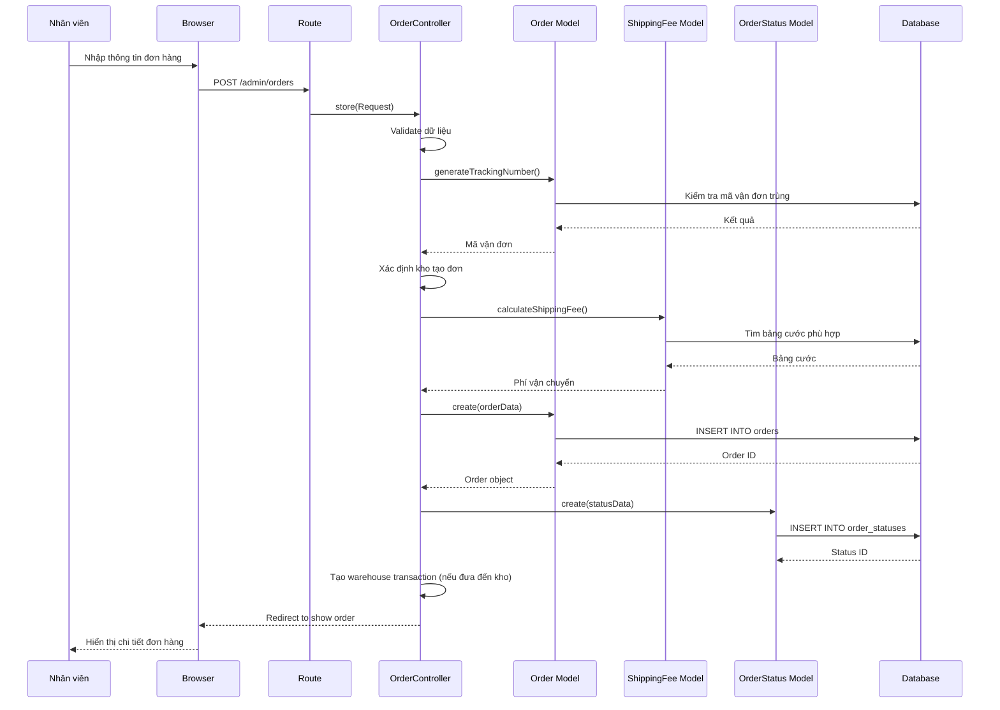
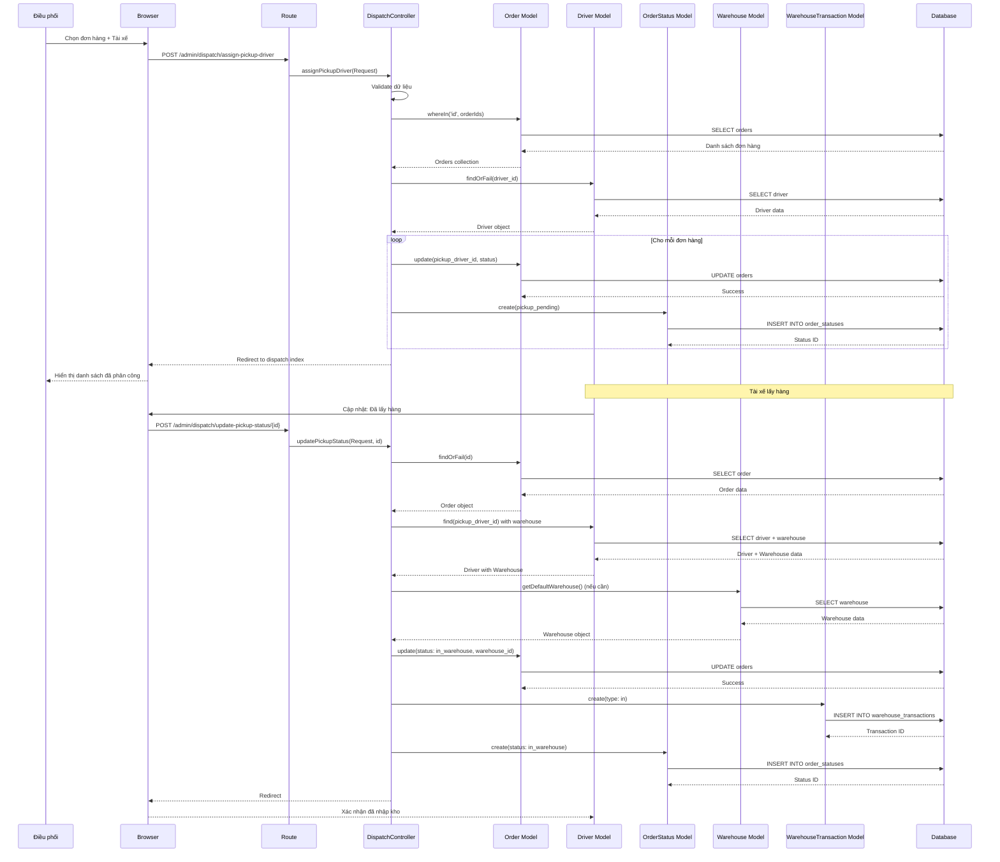
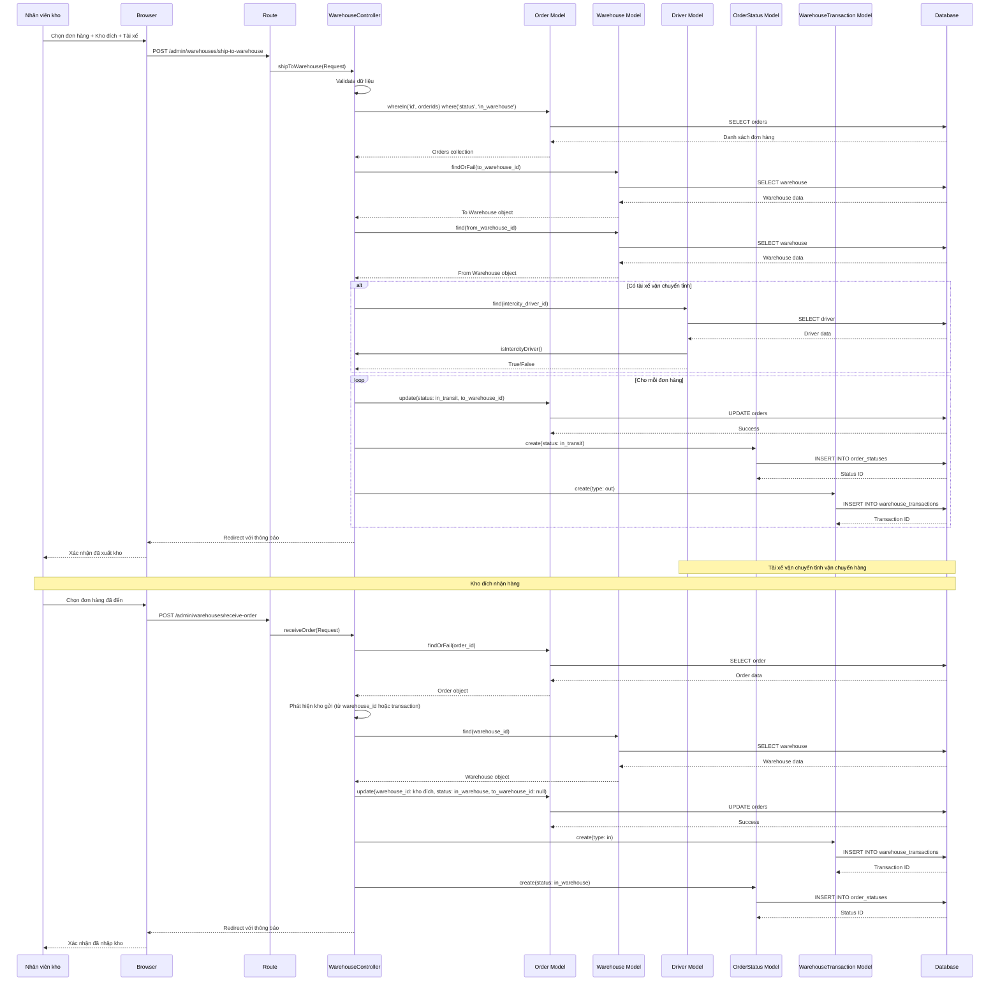
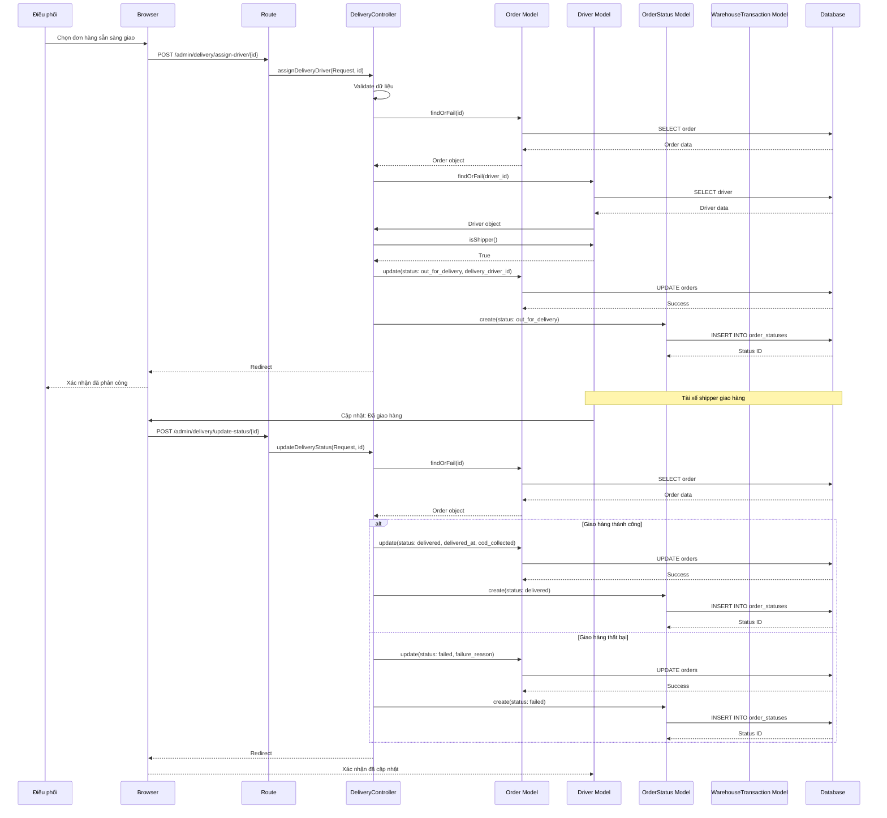
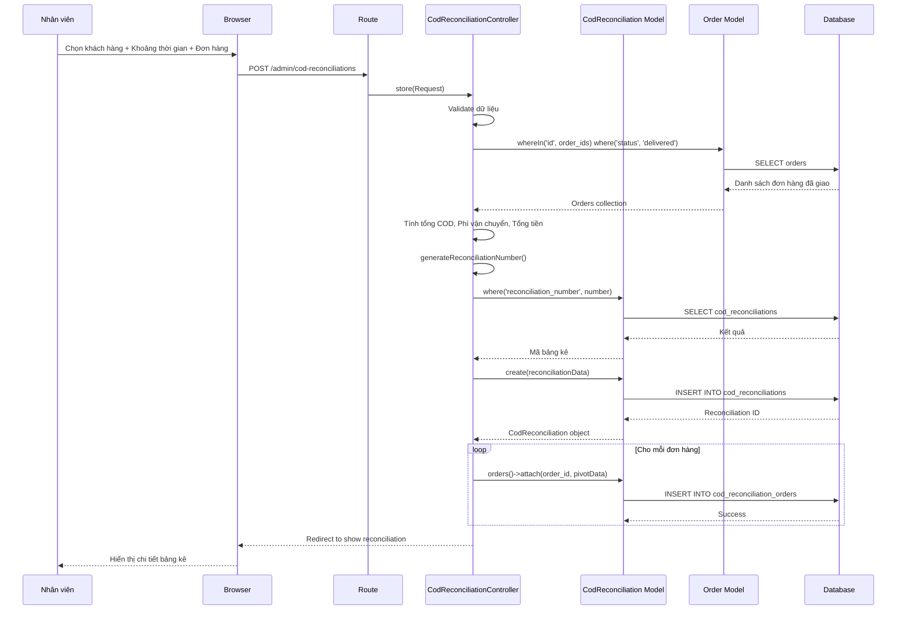
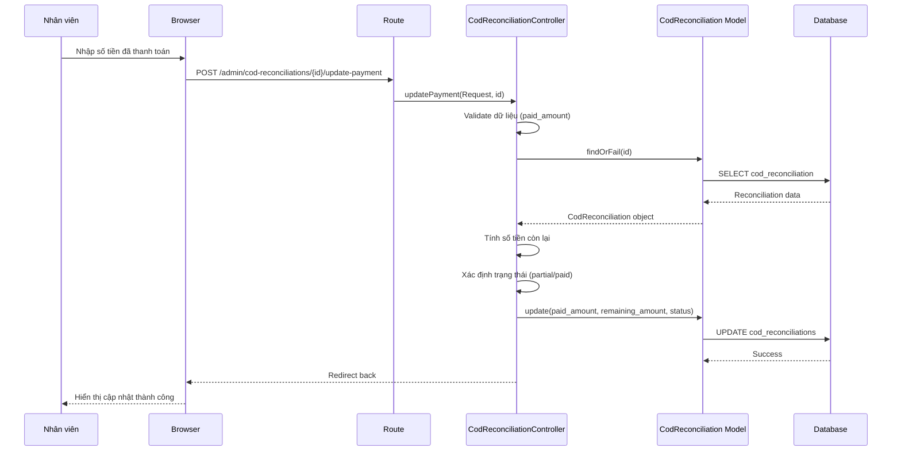
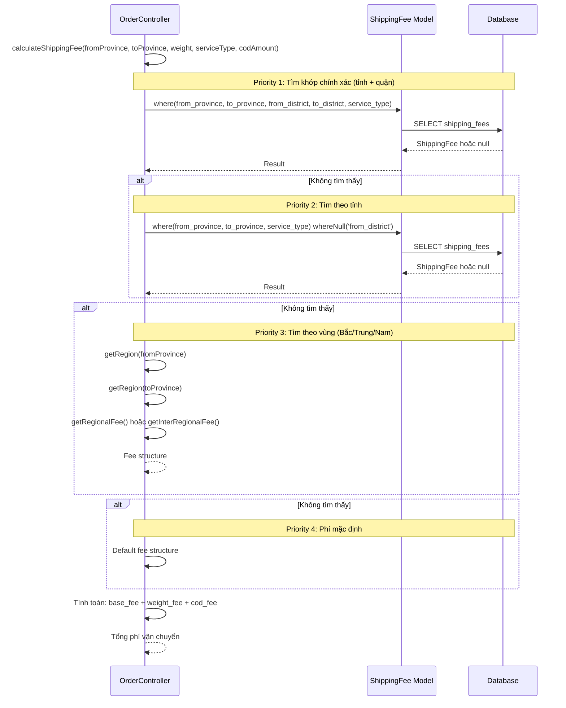
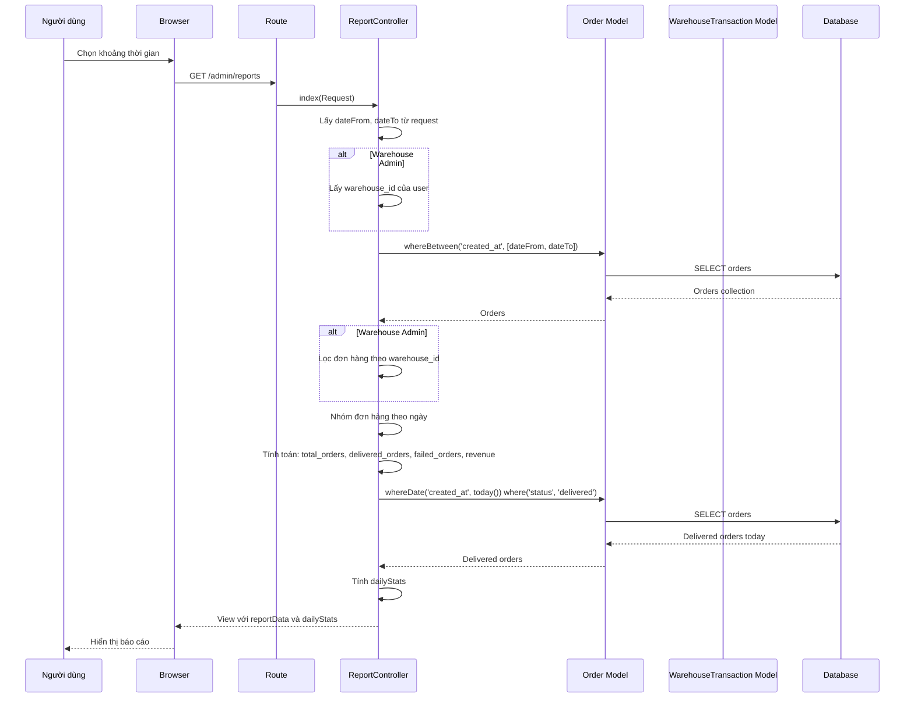
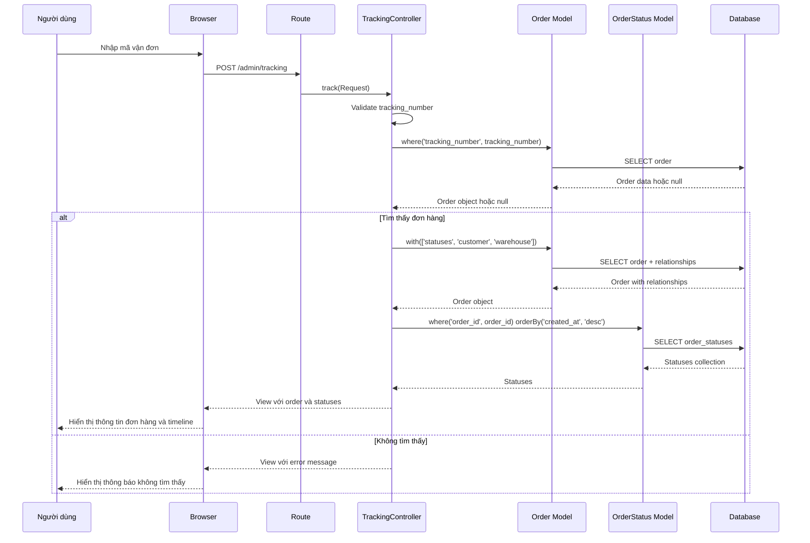
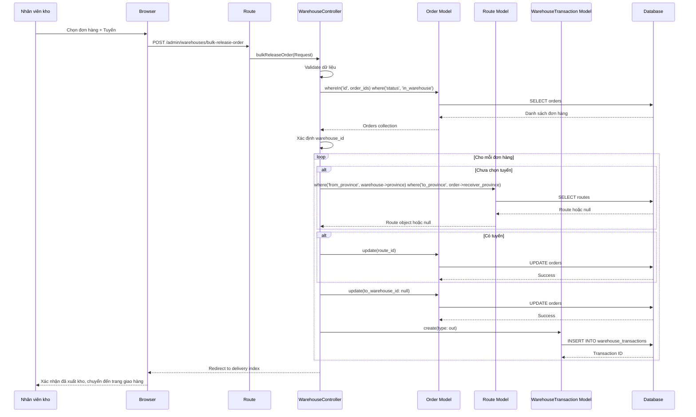

# BIỂU ĐỒ TUẦN TỰ (SEQUENCE DIAGRAMS) - HỆ THỐNG QUẢN LÝ VẬN CHUYỂN

## 1. BIỂU ĐỒ TUẦN TỰ - TẠO ĐƠN HÀNG

## 2. BIỂU ĐỒ TUẦN TỰ - LẤY HÀNG VÀ NHẬP KHO

## 3. BIỂU ĐỒ TUẦN TỰ - VẬN CHUYỂN GIỮA CÁC KHO

## 4. BIỂU ĐỒ TUẦN TỰ - GIAO HÀNG CHO KHÁCH HÀNG

## 5. BIỂU ĐỒ TUẦN TỰ - TẠO BẢNG KÊ COD

## 6. BIỂU ĐỒ TUẦN TỰ - CẬP NHẬT THANH TOÁN COD

## 7. BIỂU ĐỒ TUẦN TỰ - TÍNH PHÍ VẬN CHUYỂN

## 8. BIỂU ĐỒ TUẦN TỰ - XEM BÁO CÁO

## 9. BIỂU ĐỒ TUẦN TỰ - TRA CỨU ĐƠN HÀNG

## 10. BIỂU ĐỒ TUẦN TỰ - XUẤT KHO CHO SHIPPER

