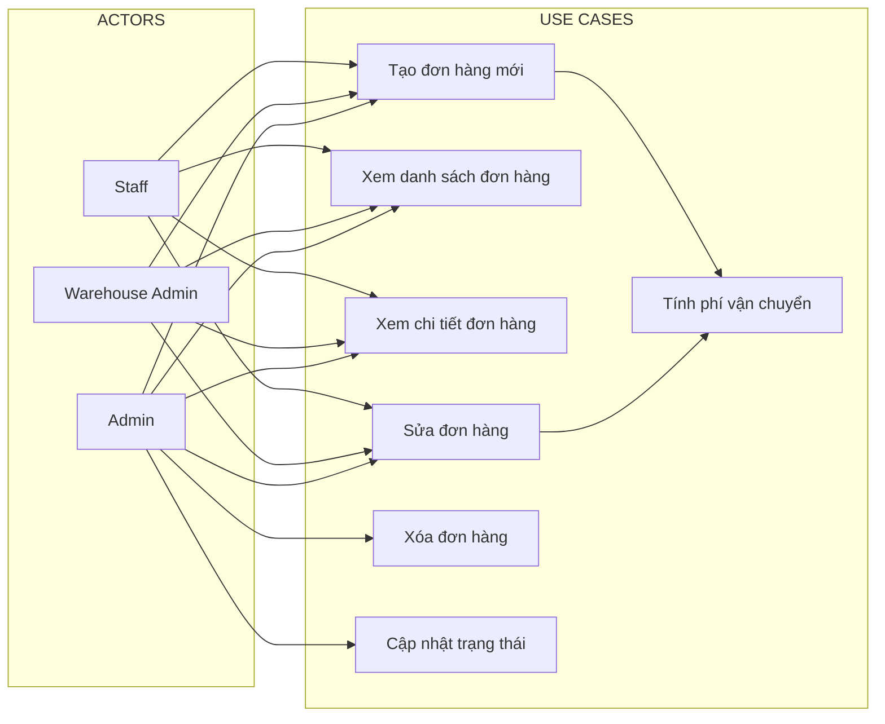
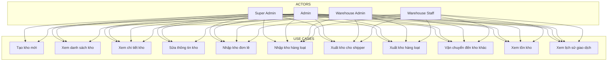
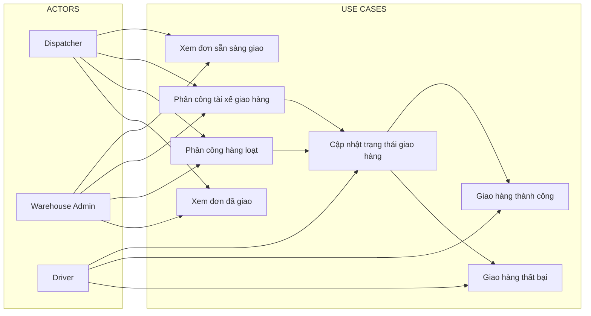
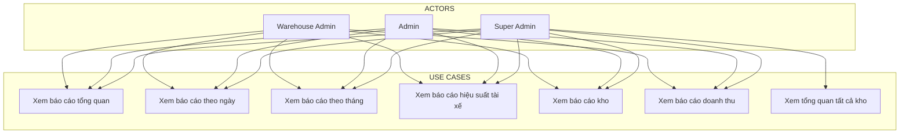

# BIỂU ĐỒ USE CASE - HỆ THỐNG QUẢN LÝ VẬN CHUYỂN

## 1. BIỂU ĐỒ USE CASE TỔNG QUAN

```mermaid
graph TB
    subgraph Actors["ACTORS"]
        SA[Super Admin]
        A[Admin]
        WA[Warehouse Admin]
        D[Dispatcher]
        WS[Warehouse Staff]
        DR[Driver]
        ST[Staff]
    end

    subgraph UC["USE CASES"]
        subgraph QuanLyDonHang["Quản Lý Đơn Hàng"]
            UC1[Tạo đơn hàng]
            UC2[Xem danh sách đơn hàng]
            UC3[Xem chi tiết đơn hàng]
            UC4[Sửa đơn hàng]
            UC5[Xóa đơn hàng]
            UC6[Cập nhật trạng thái đơn hàng]
        end

        subgraph DieuPhoi["Điều Phối"]
            UC7[Phân công tài xế lấy hàng]
            UC8[Tự động phân công tài xế]
            UC9[Cập nhật trạng thái lấy hàng]
        end

        subgraph QuanLyKho["Quản Lý Kho"]
            UC10[Xem danh sách kho]
            UC11[Tạo kho mới]
            UC12[Xem chi tiết kho]
            UC13[Sửa thông tin kho]
            UC14[Nhập kho]
            UC15[Nhập kho hàng loạt]
            UC16[Xuất kho cho shipper]
            UC17[Xuất kho hàng loạt]
            UC18[Vận chuyển đến kho khác]
        end

        subgraph GiaoHang["Giao Hàng"]
            UC19[Xem đơn sẵn sàng giao]
            UC20[Phân công tài xế giao hàng]
            UC21[Phân công hàng loạt]
            UC22[Cập nhật trạng thái giao hàng]
            UC23[Xem đơn đã giao]
        end

        subgraph QuanLyKhachHang["Quản Lý Khách Hàng"]
            UC24[Xem danh sách khách hàng]
            UC25[Tạo khách hàng mới]
            UC26[Xem chi tiết khách hàng]
            UC27[Sửa khách hàng]
            UC28[Xóa khách hàng]
        end

        subgraph QuanLyTaiXe["Quản Lý Tài Xế"]
            UC29[Xem danh sách tài xế]
            UC30[Tạo tài xế mới]
            UC31[Xem chi tiết tài xế]
            UC32[Cập nhật tài xế]
        end

        subgraph QuanLyTuyen["Quản Lý Tuyến"]
            UC33[Xem danh sách tuyến]
            UC34[Tạo tuyến mới]
            UC35[Xem chi tiết tuyến]
        end

        subgraph TraCuu["Tra Cứu"]
            UC36[Tra cứu đơn hàng công khai]
            UC37[Tra cứu đơn hàng chi tiết]
        end

        subgraph PhíVanChuyen["Phí Vận Chuyển"]
            UC38[Xem bảng cước]
            UC39[Tính phí vận chuyển]
            UC40[Tạo bảng cước mới]
        end

        subgraph BaoCao["Báo Cáo"]
            UC41[Xem báo cáo tổng quan]
            UC42[Xem báo cáo theo ngày]
            UC43[Xem báo cáo theo tháng]
            UC44[Xem báo cáo hiệu suất tài xế]
            UC45[Xem báo cáo kho]
            UC46[Xem báo cáo doanh thu]
            UC47[Xem tổng quan tất cả kho]
        end

        subgraph BangKeCOD["Bảng Kê COD"]
            UC48[Xem danh sách bảng kê]
            UC49[Tạo bảng kê mới]
            UC50[Xem chi tiết bảng kê]
            UC51[Cập nhật thanh toán]
        end

        subgraph QuanLyNguoiDung["Quản Lý Người Dùng"]
            UC52[Xem danh sách người dùng]
            UC53[Tạo người dùng mới]
            UC54[Xem chi tiết người dùng]
            UC55[Sửa người dùng]
            UC56[Xóa người dùng]
        end

        subgraph Dashboard["Dashboard"]
            UC57[Xem dashboard]
            UC58[Xem thống kê tổng quan]
        end
    end

    %% Super Admin - Tất cả quyền
    SA --> UC1 & UC2 & UC3 & UC4 & UC5 & UC6
    SA --> UC7 & UC8 & UC9
    SA --> UC10 & UC11 & UC12 & UC13 & UC14 & UC15 & UC16 & UC17 & UC18
    SA --> UC19 & UC20 & UC21 & UC22 & UC23
    SA --> UC24 & UC25 & UC26 & UC27 & UC28
    SA --> UC29 & UC30 & UC31 & UC32
    SA --> UC33 & UC34 & UC35
    SA --> UC36 & UC37
    SA --> UC38 & UC39 & UC40
    SA --> UC41 & UC42 & UC43 & UC44 & UC45 & UC46 & UC47
    SA --> UC48 & UC49 & UC50 & UC51
    SA --> UC52 & UC53 & UC54 & UC55 & UC56
    SA --> UC57 & UC58

    %% Admin - Hầu hết quyền (trừ quản lý người dùng)
    A --> UC1 & UC2 & UC3 & UC4 & UC5 & UC6
    A --> UC7 & UC8 & UC9
    A --> UC10 & UC11 & UC12 & UC13 & UC14 & UC15 & UC16 & UC17 & UC18
    A --> UC19 & UC20 & UC21 & UC22 & UC23
    A --> UC24 & UC25 & UC26 & UC27 & UC28
    A --> UC29 & UC30 & UC31 & UC32
    A --> UC33 & UC34 & UC35
    A --> UC36 & UC37
    A --> UC38 & UC39 & UC40
    A --> UC41 & UC42 & UC43 & UC44 & UC45 & UC46
    A --> UC48 & UC49 & UC50 & UC51
    A --> UC57 & UC58

    %% Warehouse Admin - Quản lý kho của mình
    WA --> UC1 & UC2 & UC3 & UC4
    WA --> UC7 & UC8 & UC9
    WA --> UC12 & UC13 & UC14 & UC15 & UC16 & UC17 & UC18
    WA --> UC19 & UC20 & UC21 & UC22 & UC23
    WA --> UC24 & UC25 & UC26 & UC27
    WA --> UC29 & UC30 & UC31 & UC32
    WA --> UC36 & UC37
    WA --> UC38 & UC39
    WA --> UC41 & UC42 & UC43 & UC44 & UC45 & UC46
    WA --> UC48 & UC49 & UC50 & UC51
    WA --> UC57 & UC58

    %% Dispatcher - Điều phối
    D --> UC2 & UC3
    D --> UC7 & UC8 & UC9
    D --> UC19 & UC20 & UC21 & UC22
    D --> UC29 & UC31
    D --> UC36 & UC37
    D --> UC57

    %% Warehouse Staff - Nhân viên kho
    WS --> UC2 & UC3
    WS --> UC12 & UC14 & UC15 & UC16 & UC17 & UC18
    WS --> UC19 & UC20 & UC21
    WS --> UC36 & UC37
    WS --> UC57

    %% Driver - Tài xế
    DR --> UC3
    DR --> UC9
    DR --> UC22
    DR --> UC36 & UC37

    %% Staff - Nhân viên
    ST --> UC1 & UC2 & UC3 & UC4
    ST --> UC24 & UC25 & UC26 & UC27
    ST --> UC36 & UC37
    ST --> UC57
```

## 2. BIỂU ĐỒ USE CASE CHI TIẾT - QUẢN LÝ ĐƠN HÀNG

## 3. BIỂU ĐỒ USE CASE CHI TIẾT - QUẢN LÝ KHO

## 4. BIỂU ĐỒ USE CASE CHI TIẾT - GIAO HÀNG

## 5. BIỂU ĐỒ USE CASE CHI TIẾT - BÁO CÁO

